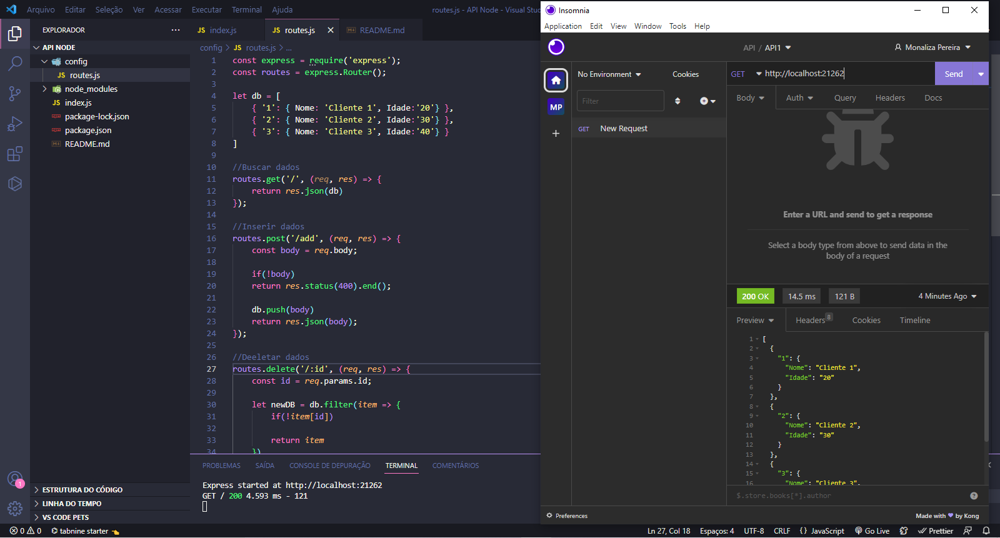

# CRUD simples com NodeJs

 

## 💻 About

Criei do zero uma API utilizando o NodeJS.
Simulando um banco local e criando as principais requisições que uma API deve conter.

Usei:
- Express
- Body-Parser
- Cors
- Nodemon
- Morgan
👩🏻‍💻

  

## 🧠 Techs

    
    
    

    

 

---

<table>
  <tr>
    <td>
      
    </td>
    <td>
    </td>
    <td>
      Feito por <a href="https://github.com/monaliza-pereira">Monaliza Pereira</a> 🔮
  </tr>
</table>
